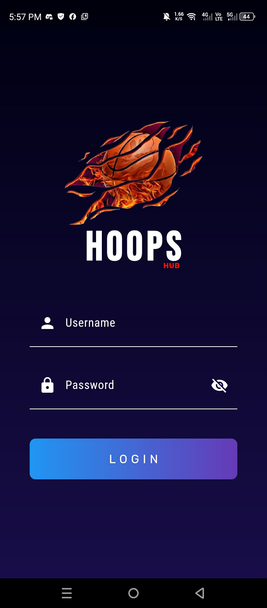
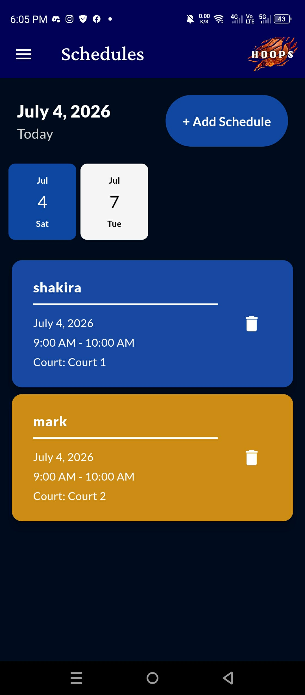
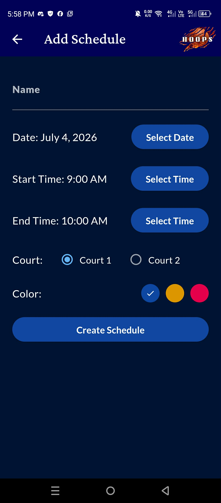
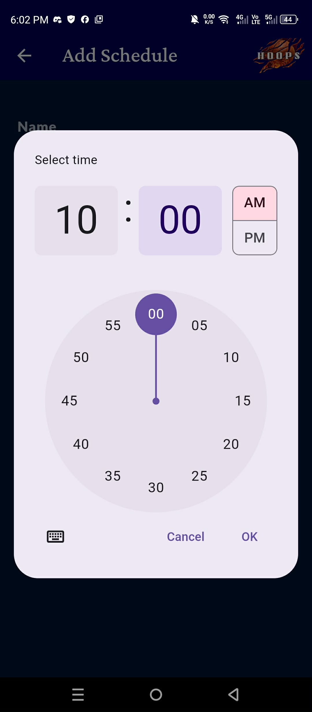
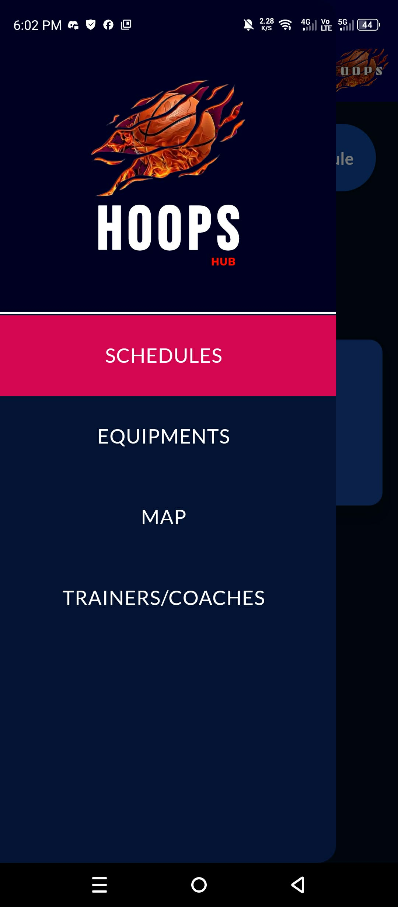
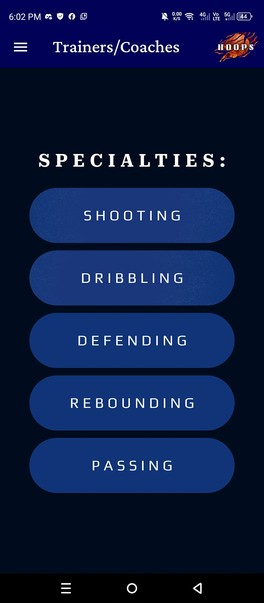
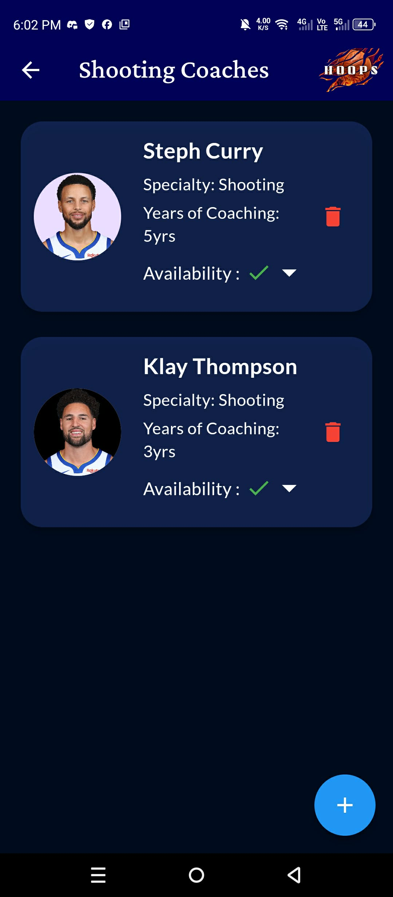
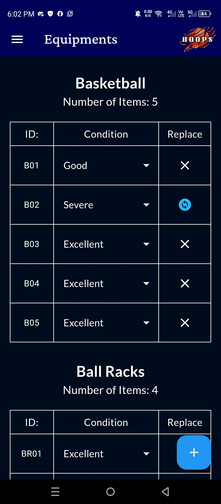

# HoopsHub

HoopsHub is a Flutter-based mobile application developed as a school project for managing basketball gym operations. It provides an intuitive interface for administrators to manage coaches, training schedules, equipment inventory, and court information.

## Features
- User authentication
- Coach management
- Equipment inventory
- Training schedule management
- Court/location information
- Image upload for coaches

## Built With
- Flutter
- Dart
- Android Studio

## Screenshots

### Login Screen

### Schedule

### Scheduling

### Time

### Sidebar

### Specialty

### Trainers

### Equipment Inventory

## License
This project is intended for educational purposes.
